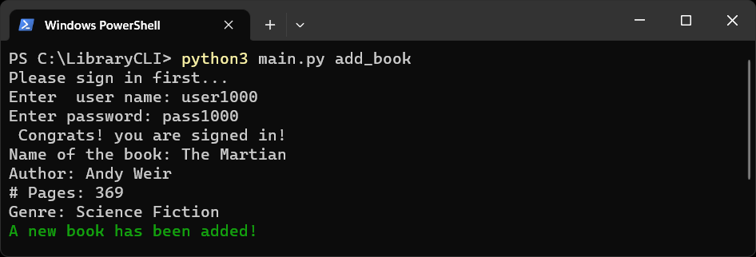

# Library CLI

## Description:

This application is a command-line interface to manage a local library. Where users can search for books, add books, view their read and favorite books, and borrow books.

## Installation:

1. Install python.

2. Install the requirements:
```bash
pip install -r requirements.txt
```
3. Start a database:
```bash
python3 main.py start
```

## Usage and Commands:
```bash
 Usage: main.py [OPTIONS] COMMAND [ARGS]...
 Usage: main.py [OPTIONS] COMMAND [ARGS]...

╭─ Options ─────────────────────────────────────────────────────────────────────────────────────────╮
│ --install-completion          Install completion for the current shell.                           │
│ --show-completion             Show completion for the current shell, to copy it or customize the  │
│                               installation.                                                       │
│ --help                        Show this message and exit.                                         │
╰───────────────────────────────────────────────────────────────────────────────────────────────────╯
╭─ Commands ────────────────────────────────────────────────────────────────────────────────────────╮
│ add_book                                                                                          │
│ borrow_book                                                                                       │
│ del_database           Delete the current database. User start after to create a new one.         │
│ fav_book                                                                                          │
│ mark_read                                                                                         │
│ most_favorite_books                                                                               │
│ most_read_authors                                                                                 │
│ most_read_books                                                                                   │
│ most_read_genres                                                                                  │
│ my_books                                                                                          │
│ recently_added                                                                                    │
│ return_book                                                                                       │
│ search_by_author                                                                                  │
│ search_by_name                                                                                    │
│ sign_up                                                                                           │
│ start                  Check if the database is available, and if not create a new database.      │
│ statistics                                                                                        │
╰───────────────────────────────────────────────────────────────────────────────────────────────────╯
```

## Screenshots:
### search_by_name 'SEARCH WORDS'
```bash
python3 main.py search_by_name 'of'
```


### search_by_author 'AUTHOR NAME'
```bash
python3 main.py search_by_author 'george'
```


### most_read_books 'GENRE NAME'
```bash
python3 main.py most_read_books 'Fiction'
```


### add_book
```bash
python3 main.py add_book
```


### borrow_book BOOK_ID
```bash
python3 main.py borrow_book 4
```


### my_books
```bash
python3 main.py my_books
```


### statistics
```bash
python3 main.py statistics
```


## Collaborators/team members:

Project given by: [Fenyx IT Academy](https://github.com/fenyx-it-academy)

### Team members:

[Elena Kostina](https://github.com/elen-ladder)

[Haftom Zewde Lemlem](https://github.com/HaftomZ)

[Ziad Jradeh](https://github.com/ziad-jradeh)


